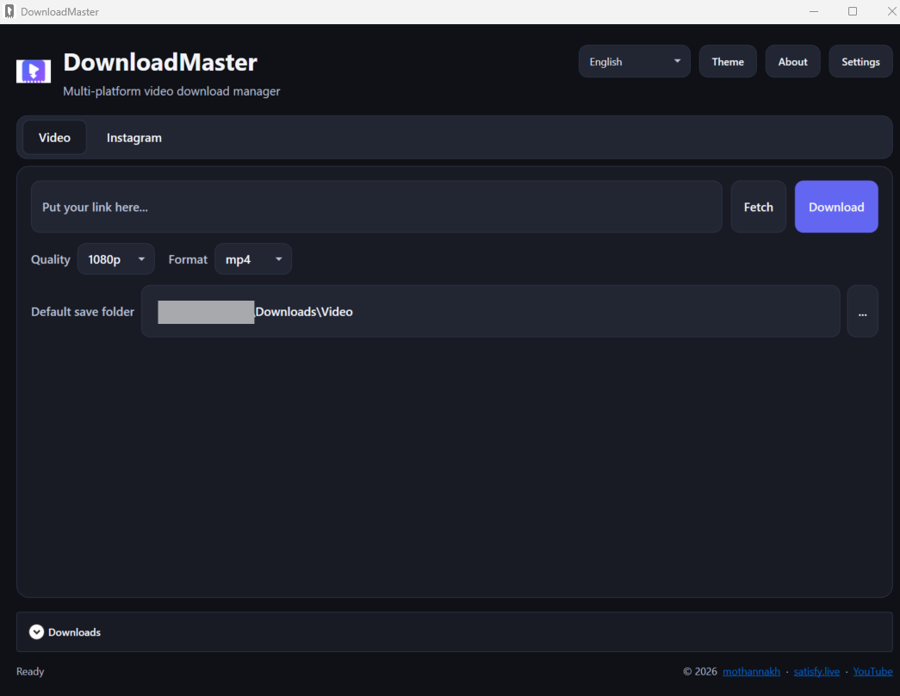
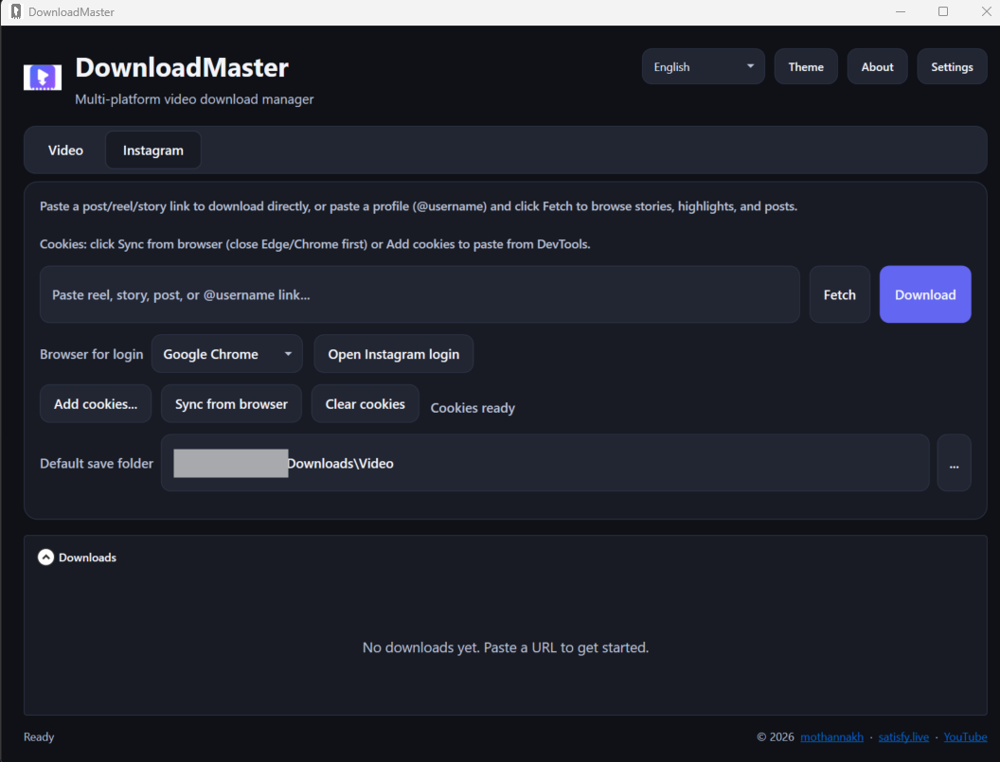
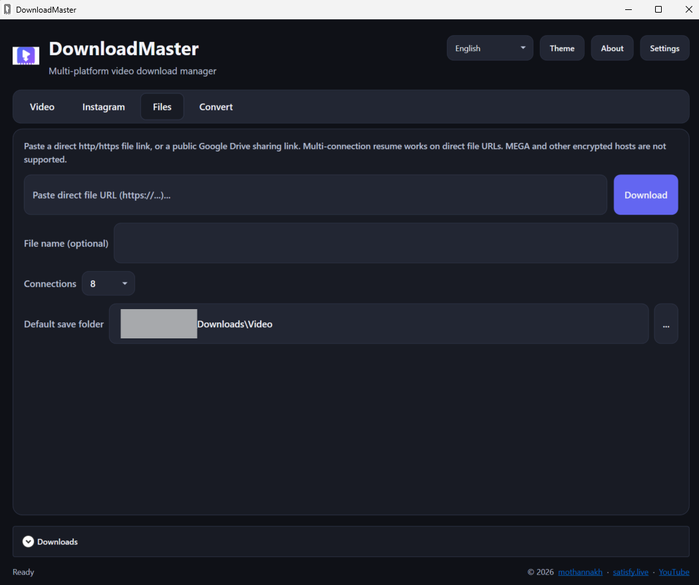
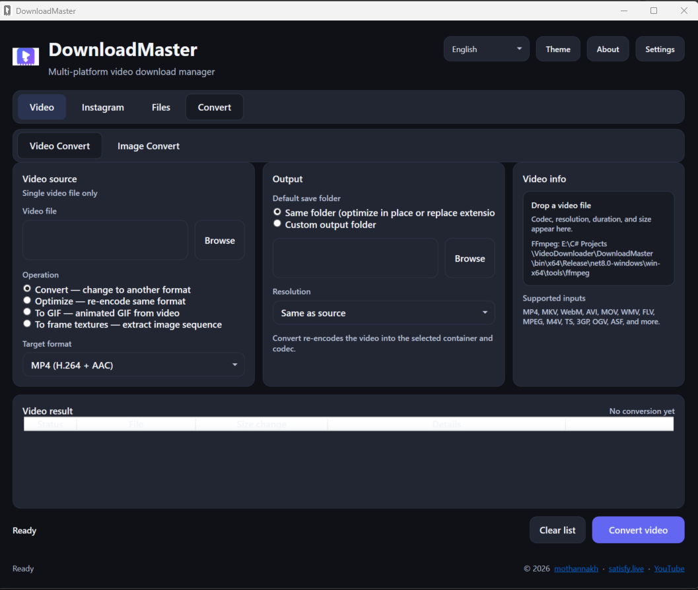
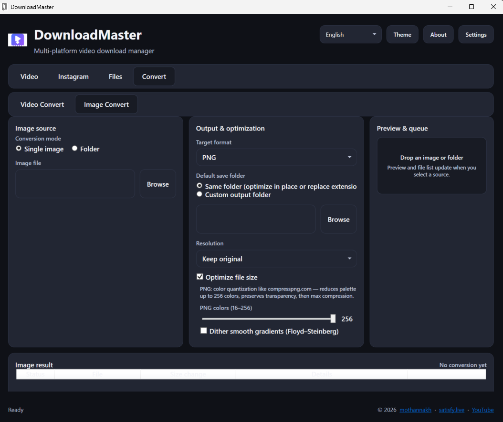
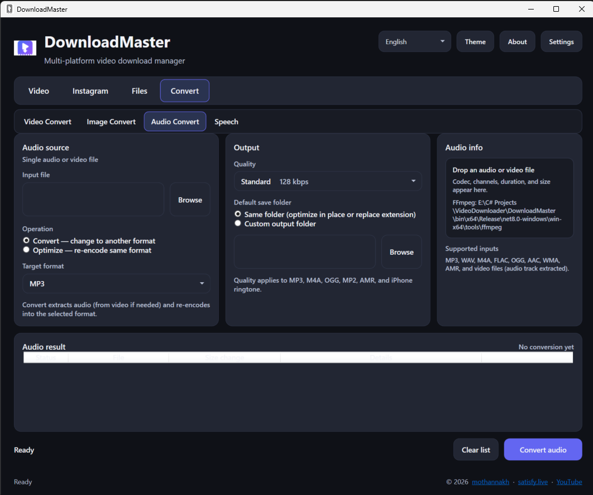
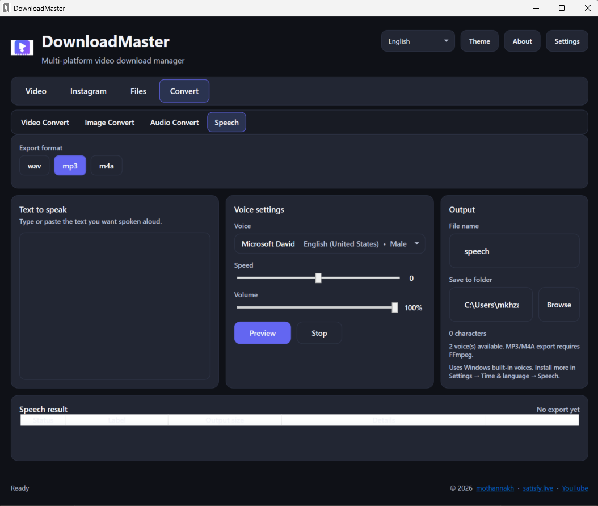
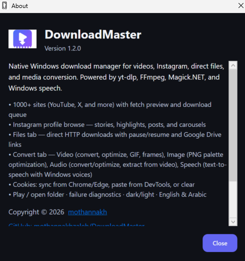
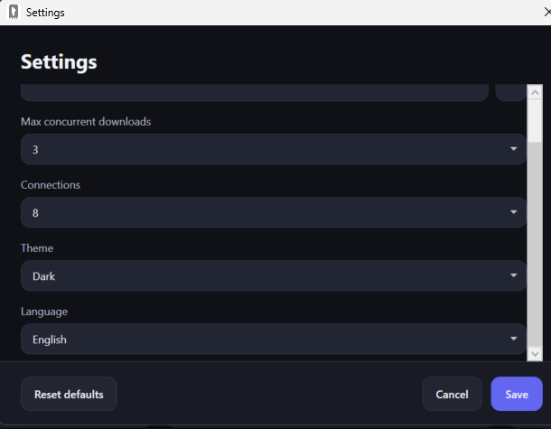
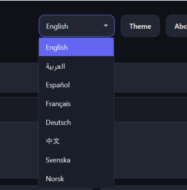

# DownloadMaster

[](https://github.com/mothannakhzaleh/DownloadMaster/releases)

---

## Screenshots

| Video downloads | Instagram browse |
|-----------------|------------------|
|  |  |

| Files (direct download) | Video Convert | Image Convert |
|-------------------------|---------------|---------------|
|  |  |  |

| Audio Convert | Speech (text-to-speech) | About |
|---------------|-------------------------|-------|
|  |  |  |

| Settings | Language |
|----------|----------|
|  |  |

---

## Author

**Copyright © 2026 [mothannakh](https://github.com/mothannakhzaleh/DownloadMaster)**

- GitHub: [mothannakhzaleh/DownloadMaster](https://github.com/mothannakhzaleh/DownloadMaster)
- Website: [https://satisfy.live/](https://satisfy.live/)
- YouTube: [@ToPSourceDevelopment](https://www.youtube.com/@ToPSourceDevelopment)

---

## License

| What | License |
|------|---------|
| DownloadMaster source code | [MIT License](LICENSE) |
| yt-dlp, FFmpeg, .NET, SQLite, etc. | See [THIRD_PARTY_LICENSES.md](THIRD_PARTY_LICENSES.md) |

This project is intended for **public open-source release**. Bundled tool binaries (yt-dlp, FFmpeg) are **not** included in Git — run `setup-tools.bat` locally before building.

---

## Features

### Video (yt-dlp)
- Download from YouTube, X/Twitter, and 1000+ sites
- Fetch preview with auto-detected quality and format
- Download queue with progress, speed, and ETA
- Playlist support with selectable video list
- Per-download save folder picker
- **Open folder** and **Play** when a download completes

### Instagram
- Paste a **post/reel/story** link and download directly
- Paste a **@username** or profile link and **Fetch** to browse stories, highlights, and posts
- **Thumbnails** in the browse list · expand/collapse sections · select all
- **Carousel & highlight** rows — download one item or a whole batch
- **Cookies**: sync from Chrome/Edge, paste from DevTools, or **clear** saved session
- **Copy details** on failed downloads for troubleshooting

### Files (direct download)
- Paste a **direct http/https** file URL or public **Google Drive** link
- Multi-connection download with **pause** and **resume**
- Optional file name and connection count · `.part` resume state on disk

### Convert
- **Video Convert** — convert format, optimize in place, **GIF**, or **frame textures** (FFmpeg)
- **Image Convert** — single image or **folder batch**; PNG, JPEG, WebP, BMP, TIFF, GIF, TGA, DDS
- **PNG palette optimization** — 16–256 colors, optional dither, transparency preserved
- **Audio Convert** — convert or optimize audio; extract audio from video; MP3, WAV, M4A, FLAC, OGG, AMR, iPhone ringtone
- **Speech** — text-to-speech with Windows voices; preview, speed/volume; export WAV, MP3, or M4A
- Preview, drag-and-drop, per-file results; download queue hidden on this tab

### App
- Dark / Light themes
- English + Arabic (RTL) UI
- Standalone publish folder (single `.exe`, no .NET install required)

---

## Requirements

| Scenario | Requirement |
|----------|-------------|
| Run from source (`start.bat`) | Windows 10+, [.NET 8 SDK](https://dotnet.microsoft.com/download/dotnet/8.0) |
| Run published build | Windows 10+ only (self-contained) |

---

## Quick start

### Option A — Download release (recommended)

1. Open [Releases](https://github.com/mothannakhzaleh/DownloadMaster/releases) and download the latest `DownloadMaster-v*-win-x64.zip`
2. Extract anywhere and run `DownloadMaster.exe`

### Option B — Build from source

#### 1. Clone the repository

```bash
git clone https://github.com/mothannakhzaleh/DownloadMaster.git
cd DownloadMaster
```

#### 2. Install bundled tools (required once)

```bat
setup-tools.bat
```

This downloads **yt-dlp** and guides **FFmpeg** placement into:

```
DownloadMaster\tools\
├── yt-dlp.exe
└── ffmpeg\
    ├── ffmpeg.exe
    └── ffprobe.exe
```

#### 3. Run

```bat
start.bat
```

Builds **Release x64** and launches the app.

---

## Build & publish

| Script | Purpose |
|--------|---------|
| `start.bat` | Clean Debug → build Release x64 → run |
| `build.bat` | Build Release x64 only |
| `publish-standalone.bat` | Self-contained single-file publish + copy tools |
| `setup-tools.bat` | Download yt-dlp / verify FFmpeg |
| `release-github.bat` | Publish, zip, and upload GitHub release tag |

### GitHub release

Requires [GitHub CLI](https://cli.github.com/) (`gh auth login`).

```bat
release-github.bat
```

**Version is read automatically** from `DownloadMaster\DownloadMaster.csproj` (`<Version>` → tag `v1.1.0`). If that tag already exists on GitHub, the script **bumps the patch version** in the csproj until a free tag is found.

Optional override (skips auto-bump):

```bat
release-github.bat 1.1.0
```

Non-interactive (for scripts):

```bat
release-github.bat --yes
```

Creates `artifacts\DownloadMaster-v1.1.0-win-x64.zip`, uploads it to a new GitHub release with **last updated** date and changelog from `docs\release-notes-template.md`, then cleans local zip, notes, `publish\`, and `artifacts\`.

### Publish output

```bat
publish-standalone.bat
```

```
publish\
├── DownloadMaster.exe      ← ~225 MB self-contained
└── tools\
    ├── yt-dlp.exe
    └── ffmpeg\
        ├── ffmpeg.exe
        └── ffprobe.exe
```

Copy the entire `publish\` folder to any Windows PC and run `DownloadMaster.exe`.

### Visual Studio

Open `DownloadMaster.sln` — default configuration: **Release | x64**.

---

## Settings

Stored at:

```
%AppData%\DownloadMaster\settings.json
```

Includes default save folder, theme, language, max concurrent downloads, and Instagram cookie path.

Instagram cookies (never committed to Git) are stored at:

```
%AppData%\DownloadMaster\instagram-cookies.txt
```

---

## Project documentation

- [docs/STRUCTURE.md](docs/STRUCTURE.md) — full repository layout and architecture
- [docs/TODO.md](docs/TODO.md) — planned features (e.g. MEGA support)
- [docs/release-notes-template.md](docs/release-notes-template.md) — GitHub release notes template
- [THIRD_PARTY_LICENSES.md](THIRD_PARTY_LICENSES.md) — licenses for all dependencies and bundled tools

---

## Repository layout (summary)

```
VideoDownloader/
├── DownloadMaster.sln
├── Directory.Build.props
├── LICENSE
├── THIRD_PARTY_LICENSES.md
├── README.md
├── docs/
│   ├── img1.png              # README screenshot (video tab)
│   ├── img2.png              # README screenshot (Instagram tab)
│   ├── img3.png              # README screenshot (Files tab)
│   ├── img4.png              # README screenshot (Video Convert)
│   ├── img5.png              # README screenshot (Image Convert)
│   ├── img6.png              # README screenshot (Audio Convert)
│   ├── img7.png              # README screenshot (Speech)
│   ├── img8.png              # README screenshot (About)
│   ├── img9.png              # README screenshot (Settings)
│   ├── img10.png             # README screenshot (Language)
│   ├── STRUCTURE.md
│   └── release-notes-template.md
├── DownloadMaster/           # WPF application
│   ├── Assets/
│   ├── Models/
│   ├── Services/
│   ├── Styles/
│   ├── Themes/
│   ├── tools/                # yt-dlp + FFmpeg (gitignored binaries)
│   └── ...
├── setup-tools.bat
├── start.bat
├── build.bat
├── publish-standalone.bat
└── release-github.bat
```

---

## Contributing

Pull requests are welcome. By contributing, you agree that your contributions will be licensed under the same [MIT License](LICENSE) as the project.

---

## Disclaimer

Use DownloadMaster responsibly and only for content you have the right to download. The author is not responsible for misuse of this software or for third-party site terms of service.
